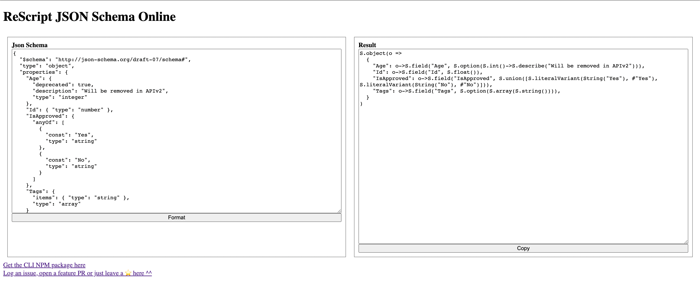

[](https://github.com/DZakh/rescript-json-schema/actions/workflows/ci.yml)
[](https://codecov.io/gh/DZakh/rescript-json-schema)
[](https://www.npmjs.com/package/rescript-json-schema)

# ReScript JSON Schema

Typesafe JSON Schema for ReScript

- Provides ReScript types to work with [JSON schema](https://json-schema.org/)
- Converts [**rescript-struct**](https://github.com/DZakh/rescript-struct) into JSON schemas
- Converts JSON schemas to [**rescript-struct**](https://github.com/DZakh/rescript-struct)

## Install

```sh
npm install rescript-json-schema rescript-struct
```

Then add `rescript-json-schema` and `rescript-struct` to `bs-dependencies` in your `bsconfig.json`:

```diff
{
  ...
+ "bs-dependencies": ["rescript-json-schema", "rescript-struct"]
+ "bsc-flags": ["-open RescriptStruct"],
}
```

## Create JSON schemas with type safety

One of the library's main features is the **rescript-struct**, which provides a way to describe the structure of a value. This structure contains meta information used for parsing, serializing, and generating JSON Schema. When working with the library, you will mostly interact with **rescript-struct** to define the structure of the values you are working with.

For example, if you have the following struct:

```rescript
type rating =
  | @as("G") GeneralAudiences
  | @as("PG") ParentalGuidanceSuggested
  | @as("PG13") ParentalStronglyCautioned
  | @as("R") Restricted
type film = {
  id: float,
  title: string,
  tags: array<string>,
  rating: rating,
  deprecatedAgeRestriction: option<int>,
}

let filmStruct = S.object(s => {
  id: s.field("Id", S.float),
  title: s.field("Title", S.string),
  tags: s.fieldOr("Tags", S.array(S.string), []),
  rating: s.field(
    "Rating",
    S.union([
      S.literal(GeneralAudiences),
      S.literal(ParentalGuidanceSuggested),
      S.literal(ParentalStronglyCautioned),
      S.literal(Restricted),
    ]),
  ),
  deprecatedAgeRestriction: s.field("Age", S.option(S.int)->S.deprecate("Use rating instead")),
})
```

You can use it to generate JSON Schema for the value it describes:

```rescript
JSONSchema.make(filmStruct)
```

```json
{
  "$schema": "http://json-schema.org/draft-07/schema#",
  "type": "object",
  "properties": {
    "Id": { "type": "number" },
    "Title": { "type": "string" },
    "Tags": { "items": { "type": "string" }, "type": "array", "default": [] },
    "Rating": {
      "anyOf": [
        { "type": "string", "const": "G" },
        { "type": "string", "const": "PG" },
        { "type": "string", "const": "PG13" },
        { "type": "string", "const": "R" }
      ]
    },
    "Age": {
      "type": "integer",
      "deprecated": true,
      "description": "Use rating instead"
    }
  },
  "additionalProperties": true,
  "required": ["Id", "Title", "Rating"]
}
```

## Create **rescript-struct** from JSON schema

### Online



[Just paste your JSON schemas here!](https://dzakh.github.io/rescript-json-schema/)
